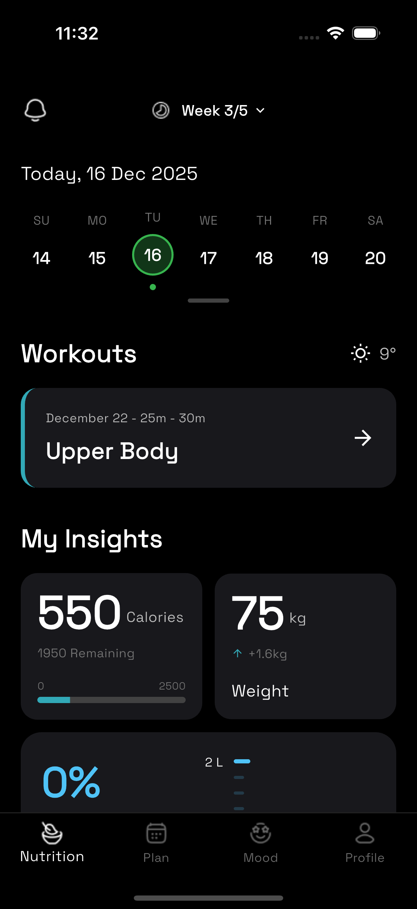
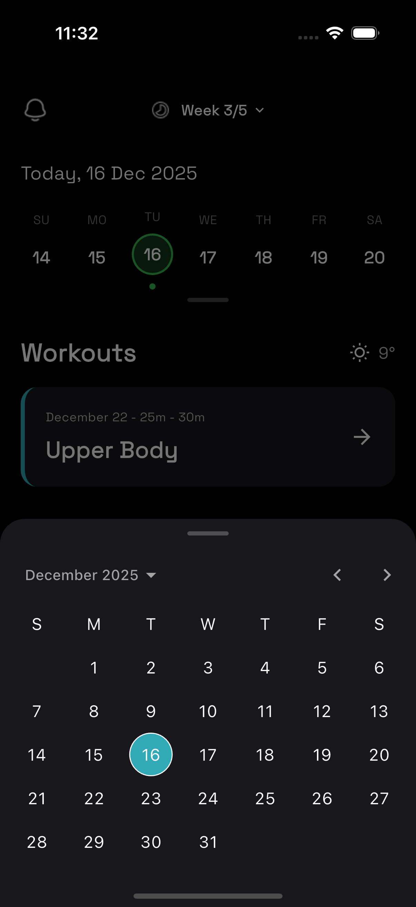
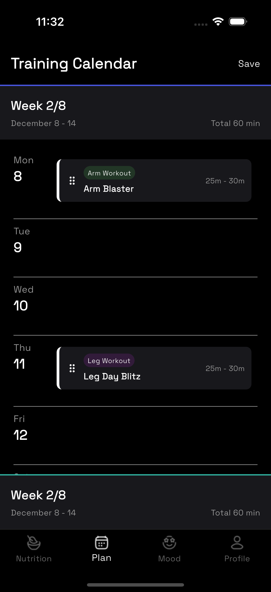
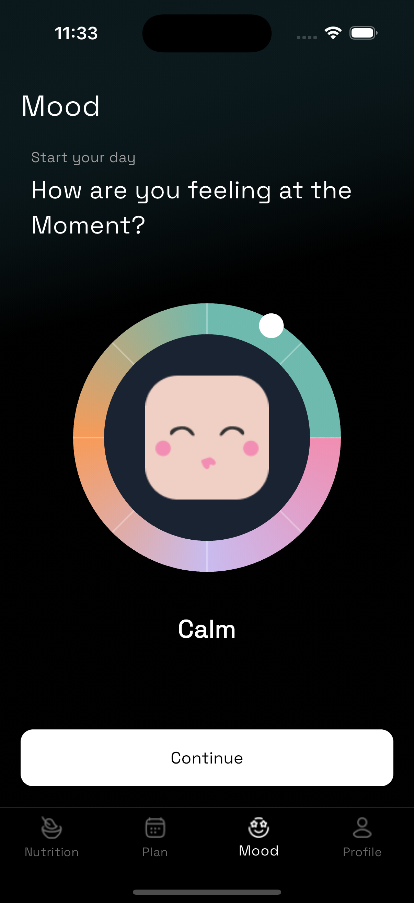

# Flutter Test Task

This repository contains my Flutter interview test project. The app demonstrates routing, responsive design, state management, and reusable UI components.

---

## 1. Dependencies Used & Why

| Dependency | Purpose |
|------------|---------|
| `go_router` | Handles app navigation and routing efficiently. |
| `responsive_framework` | Makes the app responsive across different screen sizes. |
| `intl` | Provides date, time formatting, and localization support. |
| `provider` | Used for state management across the app. |
| `google_fonts` | Easily apply custom fonts throughout the app. |
| `flutter_launcher_icons` | Generates app launcher icons for Android and iOS. |

---

## 2. Project Structure
```lib/
├── go_routes/ # Contains app routing logic
├── config/ # App-wide configuration like colors and scroll behavior
├── models/ # Data models used in the app
├── provider/ # State management classes
├── utils/ # Helper functions and constants
├── views/ # All app screens
└── widgets/ # Reusable UI components
```
> The project structure separates concerns clearly, keeping the app scalable and maintainable.

---

## 3. App Screenshots

<p float="left">
  
  
  
  
</p>

[View all screenshots](screenshots/)

---

## 4. App Video

Watch a short video demonstration of the app’s functionality:

[Watch App Demo Video](https://drive.google.com/file/d/1t6fkAltqB5YjDOY9nNK3MseMeQ6qFYIs/view?usp=sharing)

---

## 5. App APK

Download the APK to test the app on an Android device:

[Download APK](https://drive.google.com/file/d/1pd4LKMIIYNOX2fwRA-GZ7-z0sJEBLBvn/view?usp=sharing)
